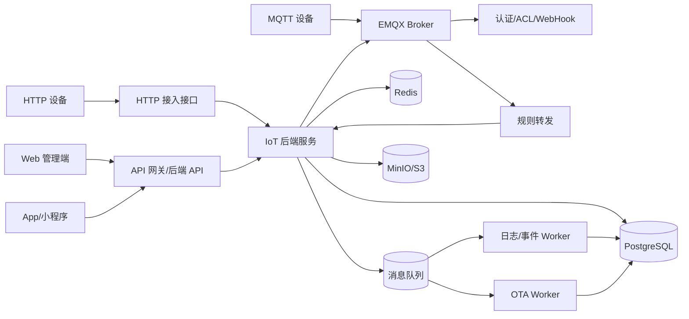
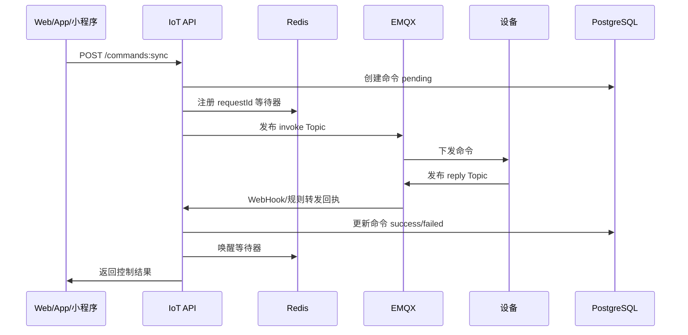
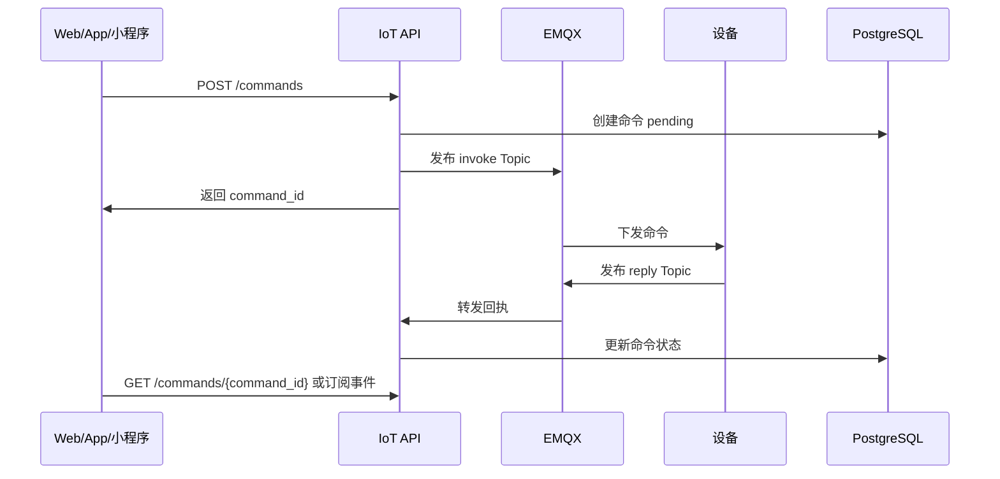
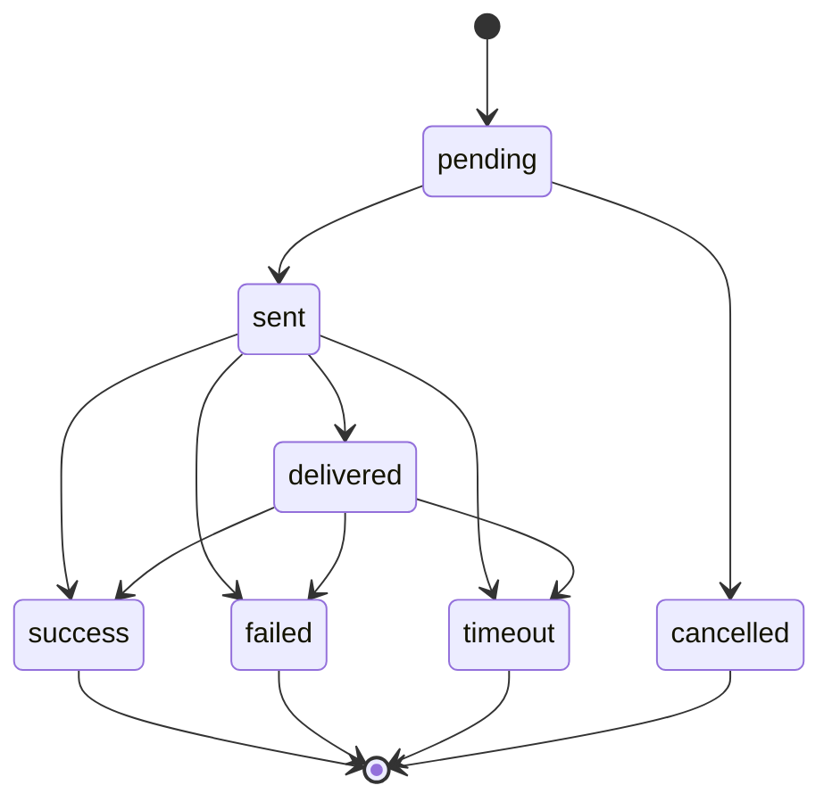
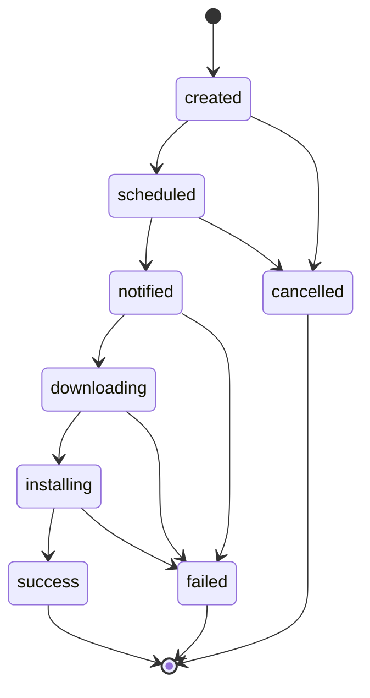
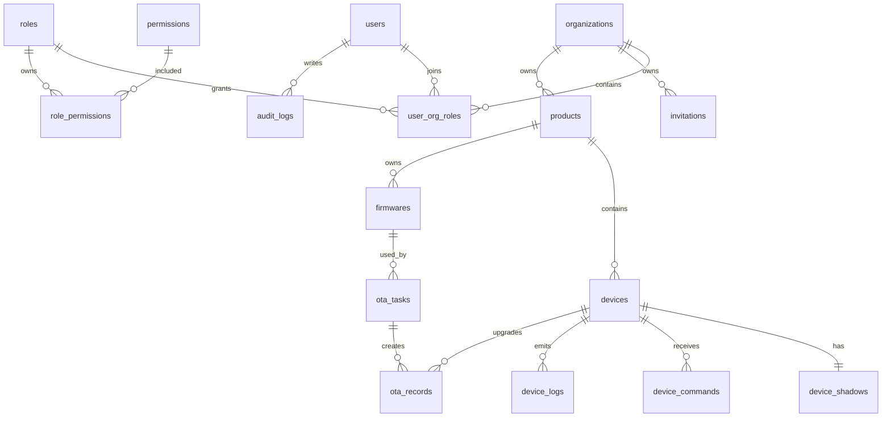

# 中小型 IoT 设备云平台技术方案 PRD

版本：v1.0  
日期：2026-04-28  
定位：面向中小型物联网项目的设备接入、管理、控制与运维后台  
形态：支持私有化部署，预留 SaaS 多租户能力

## 1. 背景与目标

本平台用于支撑中小型 IoT 业务的设备全生命周期管理。用户通过邀请码注册账号，登录后可以创建设备、接入设备、查看设备状态与日志，并通过 Web、移动端、小程序等客户端控制设备。

平台需要先满足设备管理和控制闭环，再逐步扩展 OTA、可视化大屏、视频设备接入、规则引擎等能力。

### 1.1 建设目标

- 支持邀请码注册、账号登录、组织与角色权限管理。
- 支持产品、设备、设备分组、设备凭证、设备状态管理。
- 支持 MQTT 和 HTTP 两种设备接入方式。
- 支持 Web、移动端、小程序通过统一 API 控制设备。
- 支持设备日志、事件日志、操作审计和基础告警。
- 支持 OTA 固件包管理、升级任务、升级结果追踪。
- 架构保留扩展性，后续可接入可视化大屏、视频设备、规则引擎、数据分析。

### 1.2 非目标范围

MVP 阶段不优先实现以下能力：

- 大规模百万级设备并发。
- 完整低代码物模型编辑器。
- 完整视频流媒体平台。
- 复杂数据湖、时序分析和 AI 运维。
- 面向公众开放注册的 SaaS 计费体系。

## 2. 用户与角色

### 2.1 角色定义

| 角色 | 说明 | 核心权限 |
| --- | --- | --- |
| 平台管理员 | 系统最高权限账号 | 用户、组织、邀请码、全局配置 |
| 组织管理员 | 某个组织或项目的管理员 | 成员、产品、设备、OTA、日志 |
| 运维人员 | 负责设备运维 | 设备查看、控制、日志、OTA 执行 |
| 只读用户 | 查看平台数据 | 设备、日志、统计只读 |
| 设备 | 接入平台的物理设备或网关 | 上报属性、事件、日志，接收命令 |
| 客户端应用 | Web、App、小程序 | 通过用户授权调用设备控制 API |

### 2.2 注册登录流程

1. 平台管理员创建邀请码。
2. 用户输入邀请码、手机号或邮箱、密码完成注册。
3. 系统校验邀请码状态、有效期、使用次数和绑定组织。
4. 注册成功后用户加入邀请码指定组织，获得默认角色。
5. 用户登录后获取 `access_token` 和 `refresh_token`。
6. 后端按用户角色和组织范围校验资源权限。

## 3. 产品范围

### 3.1 MVP 必做功能

| 模块 | 功能 |
| --- | --- |
| 账号与权限 | 邀请码注册、登录、刷新令牌、退出登录、角色权限 |
| 管理后台 | 首页概览、用户管理、邀请码管理、产品管理、设备管理 |
| 设备接入 | MQTT 接入、HTTP 接入、设备认证、心跳、在线状态 |
| 设备控制 | 同步控制、异步控制、命令记录、命令结果回执 |
| 设备日志 | 接入日志、事件日志、控制日志、OTA 日志 |
| OTA | 固件上传、版本管理、升级任务、升级进度、结果统计 |
| 审计 | 用户操作审计、设备关键操作审计 |

### 3.2 MVP 优先级边界

为了避免第一版范围失控，MVP 按 P0、P1、P2 拆分优先级。

| 优先级 | 定义 | 范围 |
| --- | --- | --- |
| P0 | 没有该能力就不能形成设备管理闭环 | 邀请码注册登录、组织隔离、产品设备 CRUD、设备密钥、MQTT 接入、设备影子、同步/异步控制、基础设备日志 |
| P1 | 第一版应交付，允许在 Alpha 后进入 Beta | HTTP 设备接入、OTA 固件与任务、审计日志、后台首页概览、轻量部署、备份恢复 |
| P2 | 有明确设计预留，但不进入 MVP 实现 | 可视化大屏增强、告警中心、规则引擎、视频设备接入、长期时序分析、SaaS 计费 |

MVP 发布时必须完成 P0 和 P1。P2 只要求数据模型和模块边界不阻塞后续扩展，不要求页面和接口完整可用。

### 3.3 后续扩展功能

| 扩展方向 | 说明 |
| --- | --- |
| 可视化大屏 | 接入 ECharts / DataV，按组织、产品、区域展示设备状态 |
| 视频设备接入 | 支持 GB28181、RTSP、WebRTC 或云端转码播放 |
| 规则引擎 | 设备事件触发 HTTP、MQTT、短信、Webhook |
| 告警中心 | 告警规则、告警通知、确认、关闭、升级 |
| 多租户 SaaS | 租户套餐、资源配额、账单、域名隔离 |
| 时序分析 | 后续接入 TimescaleDB 或 ClickHouse 做遥测分析，轻量版不启用 |

## 4. 总体架构

### 4.1 架构原则

- MVP 采用模块化单体后端，降低部署和开发复杂度。
- MQTT Broker、数据库、缓存、对象存储作为独立基础设施部署。
- 设备接入、设备控制、OTA、日志等模块边界清晰，后续可拆成微服务。
- 所有资源带 `org_id`，从第一版开始预留多租户隔离。
- 控制链路与日志链路异步解耦，避免设备上报高峰影响后台操作。
- API、MQTT Topic、数据库命名保持稳定，方便设备端和客户端长期兼容。

### 4.2 推荐技术栈

| 层级 | 推荐方案 | 说明 |
| --- | --- | --- |
| Web 管理端 | Next.js 16+ App Router + TypeScript + Tailwind CSS + shadcn/ui + ECharts | 前后端一体，适合快速交付管理后台和大屏 |
| 移动端/小程序 API | Next.js Route Handlers + REST API + SSE | 统一控制接口，客户端自选技术栈，WebSocket 作为后续扩展 |
| 后端 | Next.js 16+ Route Handlers / Server Actions + TypeScript | 业务 API 与管理后台共用类型和工程体系 |
| MQTT Broker | EMQX | 支持认证、ACL、规则引擎、集群扩展 |
| ORM / 数据访问 | Prisma | 管理数据库模型、迁移和类型安全访问 |
| 关系数据库 | PostgreSQL | 存储账号、设备、产品、OTA、审计 |
| 时序扩展 | TimescaleDB 或 ClickHouse | 仅作为后续扩展，轻量 MVP 不部署 |
| 缓存 | Redis | Token 黑名单、设备在线状态、命令等待结果 |
| 消息队列 | BullMQ / Redis Queue | OTA、日志入库、命令超时、异步任务处理 |
| 对象存储 | MinIO / S3 | 固件包、日志附件、后续图片视频封面 |
| 部署 | Docker Compose 轻量单机部署 | 默认适配 2 核 4GB / 70GB 系统盘，Kubernetes 仅作为后续扩展 |
| 文档 | OpenAPI 3.0 或 Zod Schema 生成文档 | 移动端、小程序和设备端统一对接 |

### 4.3 逻辑架构



### 4.4 部署架构

MVP 轻量版默认部署组件：

- `iot-web`：Next.js 应用，包含管理后台、业务 API、设备 HTTP 接入 API、EMQX 内部回调 API。
- `emqx`：MQTT Broker。
- `postgres`：主数据库。
- `redis`：缓存与在线状态。
- `minio`：固件对象存储。
- `iot-worker`：TypeScript Worker，处理日志消费、命令超时、OTA 调度等异步任务。

轻量版目标服务器：

| 资源 | 建议配置 | 约束 |
| --- | --- | --- |
| CPU | 2 核 | 不适合高频遥测和大量并发控制 |
| 内存 | 4 GB | 需要限制 PostgreSQL、Redis、EMQX 和 Node 进程内存 |
| 系统盘 | 70 GB SSD | 需要限制日志、固件包、Docker 镜像和数据库增长 |
| 部署方式 | Docker Compose | 所有核心组件同机部署 |

轻量版默认不部署：

- Prometheus。
- Grafana。
- ClickHouse。
- TimescaleDB。
- 视频服务。
- 规则引擎。
- 独立日志系统。

后续拆分方向：

- `identity-service`：账号权限。
- `device-service`：产品、设备、物模型。
- `ingress-service`：HTTP 接入和 MQTT 回调。
- `control-service`：设备命令与影子。
- `ota-service`：固件升级。
- `log-service`：日志与事件。
- `video-service`：视频接入。
- `dashboard-service`：大屏数据聚合。

### 4.5 环境规划

建议从第一版开始区分环境，避免设备端、客户端和后台调试互相影响。

| 环境 | 用途 | 说明 |
| --- | --- | --- |
| `dev` | 开发联调 | 可使用本地 Docker Compose，允许测试设备接入 |
| `test` | 测试验收 | 固定域名、固定 EMQX、独立数据库 |
| `staging` | 预发布 | 可选环境，小团队可先省略 |
| `prod` | 生产 | 启用 TLS、备份、审计、限流和日志清理 |

域名规划示例：

- 管理后台：`https://iot.example.com`
- 后端 API：`https://api.iot.example.com`
- HTTP 设备接入：`https://device-api.iot.example.com`
- MQTT 接入：`mqtts://mqtt.iot.example.com:8883`
- SSE：`https://api.iot.example.com/api/v1/events/stream`

### 4.6 模块依赖边界

模块化单体内部仍按领域分层，避免早期代码耦合过深。

| 模块 | 可依赖 | 不应依赖 |
| --- | --- | --- |
| Identity | Prisma、Redis、审计 | 设备控制、OTA |
| Product | Identity 权限上下文、Prisma | Control、OTA 执行逻辑 |
| Device | Product、Identity 权限上下文、Prisma | 前端页面逻辑 |
| Ingress | Device、Product、BullMQ/Redis Queue | Web 管理端会话 |
| Control | Device、EMQX、Redis、BullMQ/Redis Queue | OTA 任务调度 |
| OTA | Device、Firmware、MinIO、BullMQ/Redis Queue | 用户登录流程 |
| Log | 所有模块事件 | 业务写流程反向依赖日志查询 |

核心规则：

- 控制模块通过接口读取设备信息，不直接拼接产品和设备内部表结构。
- Ingress 只做认证、校验、标准化和入队，不承载复杂业务编排。
- OTA 和 Control 都可以发布设备命令，但命令生命周期统一落 `device_commands` 或独立 OTA 记录。
- 日志模块消费事件，不让核心业务同步等待日志落库。

## 5. 核心业务设计

### 5.1 组织与权限

系统采用组织隔离模型：

- 用户可属于一个或多个组织。
- 产品、设备、固件、日志、命令都归属于组织。
- 资源访问必须校验 `org_id`。
- 平台管理员可以跨组织管理。
- 组织管理员只能管理本组织资源。

权限模型采用 RBAC：

- `role`：角色。
- `permission`：权限点。
- `role_permission`：角色权限绑定。
- `user_org_role`：用户在组织内的角色。

权限点建议：

- `user:read`、`user:write`
- `invite:read`、`invite:write`
- `product:read`、`product:write`
- `device:read`、`device:write`、`device:control`
- `ota:read`、`ota:write`、`ota:execute`
- `log:read`
- `audit:read`

权限矩阵建议：

| 功能 | 平台管理员 | 组织管理员 | 运维人员 | 只读用户 |
| --- | --- | --- | --- | --- |
| 用户管理 | 全组织 | 本组织 | 无 | 无 |
| 邀请码管理 | 全组织 | 本组织 | 无 | 无 |
| 产品管理 | 全组织 | 本组织 | 只读 | 只读 |
| 设备管理 | 全组织 | 本组织 | 本组织设备读写 | 只读 |
| 设备控制 | 全组织 | 本组织 | 本组织设备控制 | 无 |
| OTA 管理 | 全组织 | 本组织 | 执行和查看 | 只读 |
| 日志查询 | 全组织 | 本组织 | 本组织 | 本组织只读 |
| 审计查询 | 全组织 | 本组织 | 无 | 无 |
| 系统配置 | 全局配置 | 本组织展示配置 | 无 | 无 |

权限校验规则：

- 平台管理员可以跨组织访问，但所有写操作仍需写审计日志。
- 组织管理员、运维人员、只读用户的查询必须自动带入当前 `org_id`。
- 用户可以属于多个组织，登录后必须有一个当前组织上下文 `current_org_id`。
- 用户首次登录时默认进入最近使用组织；没有最近使用组织时进入可访问组织列表中的第一个组织。
- 用户切换组织后，后端重新签发包含 `current_org_id` 的访问令牌或更新服务端会话上下文。
- 同一用户在同一组织内拥有多个角色时，权限取并集；任何资源访问仍必须满足 `org_id` 隔离。
- 只读用户不能调用任何 `POST`、`PATCH`、`DELETE`、控制、OTA 启动、密钥重置接口。
- 运维人员可以控制和执行 OTA，但不能创建邀请码、修改角色、删除产品。
- 设备身份只允许访问自己的 Topic 和设备端 API，不参与后台 RBAC。

### 5.2 产品与设备

产品用于定义同一类设备的接入方式和基础能力。

产品字段：

- 产品名称。
- 产品 Key。
- 接入协议：MQTT、HTTP、MQTT + HTTP。
- 认证方式：一机一密、产品密钥派生、证书认证。
- 数据格式：JSON。
- 物模型配置：MVP 可用 JSON Schema 存储。

MVP 最小物模型结构：

```json
{
  "version": "1.0",
  "properties": [
    {
      "identifier": "switch",
      "name": "开关",
      "dataType": "boolean",
      "access": "readWrite",
      "required": false
    },
    {
      "identifier": "temperature",
      "name": "温度",
      "dataType": "number",
      "unit": "celsius",
      "access": "readOnly",
      "min": -40,
      "max": 125
    }
  ],
  "events": [
    {
      "identifier": "overheated",
      "name": "过温告警",
      "level": "warn",
      "params": [
        {
          "identifier": "temperature",
          "dataType": "number",
          "required": true
        }
      ]
    }
  ],
  "services": [
    {
      "identifier": "setSwitch",
      "name": "设置开关",
      "callType": "async",
      "input": [
        {
          "identifier": "switch",
          "dataType": "boolean",
          "required": true
        }
      ],
      "output": [
        {
          "identifier": "switch",
          "dataType": "boolean",
          "required": true
        }
      ]
    }
  ]
}
```

物模型字段约束：

- `identifier` 在同一产品的 `properties`、`events`、`services` 各自集合内唯一。
- `dataType` MVP 支持 `boolean`、`integer`、`number`、`string`、`enum`、`object`、`array`。
- `access` 支持 `readOnly`、`writeOnly`、`readWrite`。
- `callType` 支持 `sync`、`async`。
- 控制面板只基于 `services.input` 生成表单。
- 属性上报只校验存在于 `properties` 中的字段；物模型为空时允许任意 JSON 对象，但页面不自动生成控制表单。

设备字段：

- 设备名称。
- 设备 Key。
- 设备 Secret。
- 所属产品。
- 所属组织。
- 在线状态。
- 激活状态。
- 固件版本。
- 标签。
- 最近上线时间、最近心跳时间、最近离线时间。

设备分组规则：

- MVP 阶段设备分组仅支持同一产品内分组。
- `device_groups.product_id` 在 MVP 中必填；跨产品分组作为后续扩展预留。
- 批量控制只支持同一产品、同一服务标识、同一参数结构的设备集合。
- 跨产品设备只能通过标签和筛选视图聚合展示，不支持批量控制。
- 批量导入不进入 MVP 必做范围；第一版只预留页面入口和接口设计，具体 CSV/Excel 模板在后续版本定义。

### 5.3 设备认证

MVP 推荐一机一密：

- 平台创建设备时生成 `device_key` 和 `device_secret`。
- MQTT 连接时使用 `username = product_key + ":" + device_key`。
- `password` 使用 HMAC-SHA256 签名。
- EMQX 通过 HTTP Auth 回调后端校验设备凭证。
- HTTP 接入使用请求头携带设备标识、时间戳、nonce、签名。

签名规则示例：

```text
sign = HMAC_SHA256(device_secret, method + "\n" + path + "\n" + timestamp + "\n" + nonce + "\n" + body_sha256)
```

### 5.4 MQTT Topic 规范

Topic 统一使用产品和设备维度，避免直接暴露数据库 ID。

| 方向 | Topic | 说明 |
| --- | --- | --- |
| 设备上线 | `/sys/{productKey}/{deviceKey}/status/online` | 设备上线事件 |
| 设备离线 | `/sys/{productKey}/{deviceKey}/status/offline` | 设备离线事件 |
| 属性上报 | `/sys/{productKey}/{deviceKey}/thing/property/post` | 设备上报属性 |
| 事件上报 | `/sys/{productKey}/{deviceKey}/thing/event/post` | 设备上报事件 |
| 日志上报 | `/sys/{productKey}/{deviceKey}/thing/log/post` | 设备上报日志 |
| 服务调用 | `/sys/{productKey}/{deviceKey}/thing/service/{identifier}/invoke` | 平台下发控制命令 |
| 服务回执 | `/sys/{productKey}/{deviceKey}/thing/service/{identifier}/reply` | 设备返回控制结果 |
| OTA 通知 | `/ota/{productKey}/{deviceKey}/upgrade/notify` | 平台通知升级 |
| OTA 进度 | `/ota/{productKey}/{deviceKey}/upgrade/progress` | 设备上报升级进度 |

属性上报示例：

```json
{
  "requestId": "req_20260428130000001",
  "timestamp": 1777371600000,
  "params": {
    "temperature": 26.5,
    "humidity": 60,
    "switch": true
  }
}
```

服务调用示例：

```json
{
  "requestId": "cmd_20260428130000001",
  "timestamp": 1777371600000,
  "params": {
    "switch": true
  }
}
```

服务回执示例：

```json
{
  "requestId": "cmd_20260428130000001",
  "code": 0,
  "message": "ok",
  "timestamp": 1777371601000,
  "data": {
    "switch": true
  }
}
```

### 5.5 HTTP 设备接入

HTTP 接入适用于低频设备、网关设备或无法稳定保持 MQTT 长连接的设备。

接口：

- `POST /device-api/v1/properties`：属性上报。
- `POST /device-api/v1/events`：事件上报。
- `POST /device-api/v1/logs`：日志上报。
- `GET /device-api/v1/commands/pending`：设备拉取待执行命令。
- `POST /device-api/v1/commands/{requestId}/reply`：命令回执。
- `GET /device-api/v1/ota/tasks/current`：查询当前 OTA 任务。
- `POST /device-api/v1/ota/tasks/{taskId}/progress`：上报 OTA 进度。

### 5.6 EMQX 集成设计

EMQX 与后端通过 HTTP Auth、HTTP ACL、Webhook 和规则引擎集成。

#### 认证回调

`POST /internal/emqx/auth`

请求：

```json
{
  "clientid": "prd_xxx.dev_xxx",
  "username": "pk_xxx:dk_xxx",
  "password": "signature",
  "peerhost": "192.168.1.10",
  "proto_name": "MQTT",
  "mountpoint": ""
}
```

处理规则：

- 解析 `product_key` 和 `device_key`。
- 查询设备状态，禁用或删除设备拒绝连接。
- 校验签名和时间窗口。
- 认证成功后刷新设备最近认证时间。

#### ACL 回调

`POST /internal/emqx/acl`

规则：

- 设备只能发布自己的上报 Topic。
- 设备只能订阅自己的服务调用和 OTA Topic。
- 设备不能订阅其他设备 Topic。
- 后端服务账号可以发布控制和 OTA Topic。

#### WebHook 事件

订阅事件：

- `client.connected`
- `client.disconnected`
- `message.publish`
- `message.delivered`
- `message.acked`

处理策略：

- 上下线事件更新 Redis 在线状态，并异步写入设备日志。
- 属性、事件、日志消息进入消息队列，由 Worker 标准化入库。
- 服务回执消息更新命令状态，唤醒同步控制等待者。

可靠性和补偿策略：

- EMQX WebHook 接口只做鉴权、幂等判断和快速入队，不执行耗时业务逻辑。
- WebHook 入队成功后立即返回，队列消费失败必须重试并记录失败日志。
- 上下线事件允许短暂不一致，最终状态以 Redis 在线状态、最近心跳时间和 EMQX 当前会话状态补偿校正。
- 属性、事件、日志和命令回执通过 `requestId`、Topic、设备 ID 做幂等处理。
- 命令回执必须优先保证不重复更新最终状态；重复回执只写设备日志。
- 后续增强版可通过 EMQX Rule Engine 将关键事件投递到持久化消息队列，MVP 先使用后端 WebHook + BullMQ 重试。

### 5.7 控制链路时序

同步控制时序：



异步控制时序：



### 5.8 设备控制

控制链路支持同步和异步两种模式。

同步控制：

- 客户端调用后端控制 API。
- 后端发布 MQTT 命令。
- 后端在 Redis 中等待设备回执。
- 设备在超时时间内返回结果。
- API 返回执行结果。

适用场景：开关灯、继电器开合、门锁状态查询等短命令。

异步控制：

- 客户端调用后端控制 API。
- 后端创建命令记录并返回 `command_id`。
- 设备执行后回执。
- 客户端通过轮询或 SSE 订阅命令状态。

适用场景：耗时控制、批量设备控制、弱网设备。

命令状态：

- `pending`：待下发。
- `sent`：已下发。
- `delivered`：设备已收到。
- `success`：执行成功。
- `failed`：执行失败。
- `timeout`：超时。
- `cancelled`：已取消。

命令状态流转约束：



控制链路规则：

- 同一个 `requestId` 的设备回执只能生效一次，重复回执记录为日志，不覆盖最终状态。
- 同步控制默认超时 5 秒，接口允许传入 `timeout_ms`，最大不超过 15 秒。
- 同步控制接口必须运行在 Node.js runtime，不使用 Edge runtime。
- 同步控制不得依赖 serverless 平台的长请求能力；私有化部署默认使用自托管 Node.js。
- 异步控制默认 TTL 为 60 秒，最大不超过 24 小时。
- 离线 MQTT 设备不执行同步控制；异步控制可创建待拉取命令，仅 HTTP 设备或明确支持离线命令的设备可使用。
- 控制参数必须按产品物模型中的服务定义校验；MVP 允许物模型为空，此时只做 JSON 对象校验。

### 5.9 设备影子

MVP 建议实现轻量设备影子：

- `reported`：设备上报的最新状态。
- `desired`：平台期望设备达到的状态。
- `version`：影子版本号，避免并发覆盖。
- `updated_at`：更新时间。

影子用于：

- 页面快速展示设备最新状态。
- 弱网或离线设备恢复后同步期望状态。
- 给移动端、小程序提供统一设备状态查询接口。

### 5.10 OTA

OTA 关键对象：

- 固件包：产品、版本号、文件、大小、摘要、发布说明。
- 升级任务：目标设备范围、升级策略、时间窗口、灰度比例。
- 升级记录：每台设备的升级状态、进度、失败原因。

MVP 策略：

- 支持按产品选择设备。
- 支持立即升级和定时升级。
- 支持手动灰度：先选择部分设备验证，再扩大范围。
- 支持固件 SHA256 校验。
- 固件文件存储在 MinIO/S3。

OTA 状态：

- `created`：已创建。
- `scheduled`：已调度。
- `notified`：已通知设备。
- `downloading`：下载中。
- `installing`：安装中。
- `success`：成功。
- `failed`：失败。
- `cancelled`：取消。

OTA 状态流转约束：



OTA 执行规则：

- 固件版本在同一产品内唯一。
- 已发布固件不可修改文件地址、大小和 SHA256，只能废弃或创建新版本。
- OTA 任务启动后不可修改目标设备集合，只能取消未完成设备。
- 设备上报进度必须单调递增，除失败和取消外不能回退。
- 设备完成升级后必须上报新固件版本，平台同步更新 `devices.firmware_version`。
- HTTP 设备通过轮询获取任务，MQTT 设备通过 OTA Topic 接收通知。

### 5.11 设备日志

日志类型：

- 接入日志：连接、断开、认证失败。
- 上报日志：属性、事件、设备日志。
- 控制日志：命令下发、回执、超时。
- OTA 日志：升级通知、下载、安装、失败。
- 用户操作审计：创建、删除、控制、升级等后台操作。

MVP 存储策略：

- 关键日志写 PostgreSQL。
- 轻量版高频遥测不长期保存，只保留最新影子和短期日志。
- 设备日志默认保留 7 天，可按磁盘容量调整到 15 天。
- 后续接入 TimescaleDB 或 ClickHouse 做长期分析。

### 5.12 数据保留策略

| 数据类型 | MVP 保留策略 | 后续扩展 |
| --- | --- | --- |
| 用户、组织、角色 | 永久保留，软删除 | 支持归档 |
| 产品、设备 | 永久保留，软删除 | 支持跨组织迁移审计 |
| 设备影子 | 只保留最新状态 | 增加变更历史 |
| 设备日志 | 默认 7 天，最大建议 15 天 | 转存 ClickHouse / 对象存储 |
| 控制命令 | 默认 30 天 | 冷归档 |
| OTA 记录 | 默认 180 天 | 按合规要求延长 |
| 审计日志 | 默认 180 天，不允许普通删除 | WORM 存储或归档 |
| 固件包 | 保留当前版本和最近 2 个历史版本 | 生命周期规则清理 |

## 6. 后端服务模块

### 6.1 Identity 模块

职责：

- 登录、注册、刷新令牌、退出登录。
- 邀请码校验。
- 用户、组织、角色、权限管理。
- 密码哈希、Token 签发、Token 吊销。

关键接口：

- `POST /api/v1/auth/register`
- `POST /api/v1/auth/login`
- `POST /api/v1/auth/refresh`
- `POST /api/v1/auth/logout`
- `GET /api/v1/me`

### 6.2 Invitation 模块

职责：

- 创建邀请码。
- 设置有效期、使用次数、绑定组织和默认角色。
- 禁用邀请码。
- 查询邀请码使用记录。

### 6.3 Product 模块

职责：

- 产品增删改查。
- 接入协议配置。
- 物模型配置。
- Topic 和认证配置展示。

### 6.4 Device 模块

职责：

- 设备创建、导入、删除、禁用。
- 设备凭证生成和重置。
- 设备分组、标签。
- 在线状态维护。
- 设备影子读写。

### 6.5 Ingress 模块

职责：

- EMQX Auth / ACL 回调。
- EMQX WebHook 事件处理。
- HTTP 设备接入。
- 上报数据校验、标准化、入队。

### 6.6 Control 模块

职责：

- 统一设备控制 API。
- MQTT 命令发布。
- HTTP 设备待命令队列。
- 命令超时处理。
- 命令记录和回执处理。

### 6.7 OTA 模块

职责：

- 固件包管理。
- OTA 任务创建和调度。
- OTA 通知下发。
- OTA 进度与结果统计。

### 6.8 Log 模块

职责：

- 设备日志查询。
- 命令日志查询。
- OTA 日志查询。
- 用户操作审计查询。

### 6.9 Notification 模块

MVP 可内置在后端，后续独立。MVP 只实现 SSE，不实现 WebSocket。WebSocket 路径作为接口预留，不作为第一版验收项。

职责：

- 控制结果 SSE 推送。
- 设备上下线通知。
- OTA 任务完成通知。
- 后续扩展短信、企业微信、Webhook。

## 7. API 接口规范

### 7.1 通用约定

协议：HTTPS  
格式：JSON  
认证：`Authorization: Bearer <access_token>`  
时间：Unix 毫秒时间戳或 ISO 8601，统一返回 ISO 8601  
分页：`page` 从 1 开始，`page_size` 默认 20，最大 100  
幂等：写操作可选 `Idempotency-Key` 请求头  
追踪：所有响应返回 `request_id`

统一响应：

```json
{
  "code": 0,
  "message": "ok",
  "request_id": "req_xxx",
  "data": {}
}
```

分页响应：

```json
{
  "code": 0,
  "message": "ok",
  "request_id": "req_xxx",
  "data": {
    "items": [],
    "page": 1,
    "page_size": 20,
    "total": 0
  }
}
```

错误码：

| code | HTTP | 说明 |
| --- | --- | --- |
| 0 | 200 | 成功 |
| 400001 | 400 | 参数错误 |
| 401001 | 401 | 未登录或 Token 失效 |
| 403001 | 403 | 无权限 |
| 404001 | 404 | 资源不存在 |
| 409001 | 409 | 资源冲突 |
| 429001 | 429 | 请求过频 |
| 500001 | 500 | 系统错误 |
| 504001 | 504 | 设备响应超时 |

接口幂等和限流：

| 场景 | 规则 |
| --- | --- |
| 登录、注册 | 按账号和 IP 限流，连续失败需要短暂冷却 |
| 邀请码注册 | 同一邀请码和 IP 限流，避免撞库 |
| 创建设备、创建产品、创建 OTA 任务 | 支持 `Idempotency-Key`，同一用户同一 Key 在 24 小时内返回同一结果 |
| 设备 HTTP 上报 | 通过 `timestamp + nonce + signature` 防重放，nonce 保存窗口默认 5 分钟 |
| 同步控制 | 按用户、组织、设备限流，默认同一设备每秒最多 1 个同步控制请求 |
| MQTT Auth 回调 | 按设备和来源 IP 限流，连续失败写接入日志 |

接口版本规则：

- MVP 所有业务接口使用 `/api/v1` 和 `/device-api/v1`。
- 破坏性变更必须新增版本，不直接修改现有字段含义。
- 响应可以新增字段，但不能删除字段或改变字段类型。
- 设备协议字段采用驼峰命名，管理 API 字段采用下划线命名。

### 7.2 账号 API

#### 注册

`POST /api/v1/auth/register`

请求：

```json
{
  "invite_code": "ABCD-1234",
  "account": "user@example.com",
  "password": "PlainPassword123",
  "display_name": "张三"
}
```

响应：

```json
{
  "code": 0,
  "message": "ok",
  "data": {
    "user_id": "usr_001",
    "org_id": "org_001"
  }
}
```

#### 登录

`POST /api/v1/auth/login`

```json
{
  "account": "user@example.com",
  "password": "PlainPassword123"
}
```

#### 当前用户

`GET /api/v1/me`

### 7.3 邀请码 API

| 方法 | 路径 | 说明 |
| --- | --- | --- |
| `POST` | `/api/v1/invitations` | 创建邀请码 |
| `GET` | `/api/v1/invitations` | 邀请码列表 |
| `GET` | `/api/v1/invitations/{id}` | 邀请码详情 |
| `POST` | `/api/v1/invitations/{id}/disable` | 禁用邀请码 |
| `GET` | `/api/v1/invitations/{id}/usages` | 使用记录 |

创建邀请码请求：

```json
{
  "org_id": "org_001",
  "role_id": "role_operator",
  "max_uses": 10,
  "expires_at": "2026-05-28T00:00:00+08:00",
  "remark": "项目 A 运维账号"
}
```

### 7.4 产品 API

| 方法 | 路径 | 说明 |
| --- | --- | --- |
| `POST` | `/api/v1/products` | 创建产品 |
| `GET` | `/api/v1/products` | 产品列表 |
| `GET` | `/api/v1/products/{product_id}` | 产品详情 |
| `PATCH` | `/api/v1/products/{product_id}` | 更新产品 |
| `DELETE` | `/api/v1/products/{product_id}` | 删除产品 |
| `PUT` | `/api/v1/products/{product_id}/thing-model` | 更新物模型 |
| `GET` | `/api/v1/products/{product_id}/thing-model` | 查询物模型 |

创建产品请求：

```json
{
  "name": "智能插座",
  "protocols": ["mqtt", "http"],
  "auth_type": "device_secret",
  "data_format": "json",
  "description": "智能插座产品"
}
```

### 7.5 设备 API

| 方法 | 路径 | 说明 |
| --- | --- | --- |
| `POST` | `/api/v1/devices` | 创建设备 |
| `GET` | `/api/v1/devices` | 设备列表 |
| `GET` | `/api/v1/devices/{device_id}` | 设备详情 |
| `PATCH` | `/api/v1/devices/{device_id}` | 更新设备 |
| `DELETE` | `/api/v1/devices/{device_id}` | 删除设备 |
| `POST` | `/api/v1/devices/{device_id}/disable` | 禁用设备 |
| `POST` | `/api/v1/devices/{device_id}/enable` | 启用设备 |
| `POST` | `/api/v1/devices/{device_id}/reset-secret` | 重置密钥 |
| `GET` | `/api/v1/devices/{device_id}/shadow` | 查询设备影子 |
| `PATCH` | `/api/v1/devices/{device_id}/shadow/desired` | 更新期望状态 |
| `GET` | `/api/v1/devices/{device_id}/logs` | 查询设备日志 |

创建设备请求：

```json
{
  "product_id": "prd_001",
  "name": "一楼插座 001",
  "device_key": "plug_001",
  "tags": {
    "location": "一楼",
    "room": "101"
  }
}
```

### 7.6 控制 API

#### 同步控制

`POST /api/v1/devices/{device_id}/commands:sync`

```json
{
  "identifier": "setSwitch",
  "params": {
    "switch": true
  },
  "timeout_ms": 5000
}
```

响应：

```json
{
  "code": 0,
  "message": "ok",
  "data": {
    "command_id": "cmd_001",
    "status": "success",
    "result": {
      "switch": true
    }
  }
}
```

#### 异步控制

`POST /api/v1/devices/{device_id}/commands`

```json
{
  "identifier": "setSwitch",
  "params": {
    "switch": true
  },
  "ttl_seconds": 60
}
```

查询命令：

`GET /api/v1/commands/{command_id}`

批量控制：

`POST /api/v1/device-groups/{group_id}/commands`

MVP 限制：

- 仅支持同一产品下的设备分组。
- 仅支持同一服务标识和同一参数结构。
- 不支持跨产品分组批量控制。

### 7.7 OTA API

| 方法 | 路径 | 说明 |
| --- | --- | --- |
| `POST` | `/api/v1/firmwares` | 创建固件记录 |
| `POST` | `/api/v1/firmwares/{firmware_id}/upload-url` | 获取上传地址 |
| `GET` | `/api/v1/firmwares` | 固件列表 |
| `GET` | `/api/v1/firmwares/{firmware_id}` | 固件详情 |
| `POST` | `/api/v1/ota/tasks` | 创建升级任务 |
| `GET` | `/api/v1/ota/tasks` | 升级任务列表 |
| `GET` | `/api/v1/ota/tasks/{task_id}` | 升级任务详情 |
| `POST` | `/api/v1/ota/tasks/{task_id}/start` | 启动任务 |
| `POST` | `/api/v1/ota/tasks/{task_id}/cancel` | 取消任务 |
| `GET` | `/api/v1/ota/tasks/{task_id}/records` | 设备升级记录 |

### 7.8 日志 API

| 方法 | 路径 | 说明 |
| --- | --- | --- |
| `GET` | `/api/v1/logs/device` | 设备日志 |
| `GET` | `/api/v1/logs/commands` | 控制日志 |
| `GET` | `/api/v1/logs/ota` | OTA 日志 |
| `GET` | `/api/v1/audit-logs` | 用户操作审计 |

查询参数：

- `org_id`
- `product_id`
- `device_id`
- `level`
- `type`
- `start_time`
- `end_time`
- `keyword`
- `page`
- `page_size`

### 7.9 SSE 事件

Web 管理端、移动端、小程序可通过事件通道接收状态变化。

推荐路径：

- SSE：`GET /api/v1/events/stream`
- WebSocket：`GET /api/v1/ws`，仅作为后续扩展预留，MVP 不实现

事件类型：

- `device.online`
- `device.offline`
- `device.property.updated`
- `command.status.changed`
- `ota.progress.changed`
- `ota.task.finished`

## 8. 数据库设计

### 8.1 命名规范

- 表名使用复数或领域名词，统一小写蛇形命名。
- 主键使用字符串 ID，格式如 `dev_xxx`、`prd_xxx`，也可用 UUIDv7。
- 所有业务表包含 `created_at`、`updated_at`。
- 多租户资源表必须包含 `org_id`。
- 软删除资源包含 `deleted_at`。
- JSON 扩展字段使用 `jsonb`。

### 8.2 核心实体关系



### 8.3 核心表

#### organizations

| 字段 | 类型 | 说明 |
| --- | --- | --- |
| id | varchar(64) PK | 组织 ID |
| name | varchar(128) | 组织名称 |
| status | varchar(32) | active / disabled |
| created_at | timestamptz | 创建时间 |
| updated_at | timestamptz | 更新时间 |

#### users

| 字段 | 类型 | 说明 |
| --- | --- | --- |
| id | varchar(64) PK | 用户 ID |
| account | varchar(128) unique | 邮箱或手机号 |
| password_hash | varchar(255) | 密码哈希 |
| display_name | varchar(128) | 昵称 |
| status | varchar(32) | active / disabled |
| last_login_at | timestamptz | 最近登录 |
| created_at | timestamptz | 创建时间 |
| updated_at | timestamptz | 更新时间 |

#### roles

| 字段 | 类型 | 说明 |
| --- | --- | --- |
| id | varchar(64) PK | 角色 ID |
| org_id | varchar(64) nullable | 组织 ID，平台角色可为空 |
| code | varchar(64) | 角色编码 |
| name | varchar(128) | 角色名称 |
| description | text | 描述 |
| created_at | timestamptz | 创建时间 |
| updated_at | timestamptz | 更新时间 |

#### permissions

| 字段 | 类型 | 说明 |
| --- | --- | --- |
| id | varchar(64) PK | 权限 ID |
| code | varchar(128) unique | 权限编码 |
| name | varchar(128) | 权限名称 |
| module | varchar(64) | 所属模块 |
| created_at | timestamptz | 创建时间 |

#### role_permissions

| 字段 | 类型 | 说明 |
| --- | --- | --- |
| role_id | varchar(64) | 角色 ID |
| permission_id | varchar(64) | 权限 ID |
| created_at | timestamptz | 创建时间 |

唯一索引：

- `(role_id, permission_id)`

#### user_org_roles

| 字段 | 类型 | 说明 |
| --- | --- | --- |
| id | varchar(64) PK | 绑定 ID |
| user_id | varchar(64) | 用户 ID |
| org_id | varchar(64) | 组织 ID |
| role_id | varchar(64) | 角色 ID |
| status | varchar(32) | active / disabled |
| created_at | timestamptz | 创建时间 |
| updated_at | timestamptz | 更新时间 |

唯一索引：

- `(user_id, org_id, role_id)`

#### invitations

| 字段 | 类型 | 说明 |
| --- | --- | --- |
| id | varchar(64) PK | 邀请码 ID |
| code_hash | varchar(255) unique | 邀请码哈希，不明文存储 |
| org_id | varchar(64) | 绑定组织 |
| role_id | varchar(64) | 默认角色 |
| max_uses | int | 最大使用次数 |
| used_count | int | 已使用次数 |
| expires_at | timestamptz | 过期时间 |
| status | varchar(32) | active / disabled / expired |
| created_by | varchar(64) | 创建人 |
| created_at | timestamptz | 创建时间 |

#### products

| 字段 | 类型 | 说明 |
| --- | --- | --- |
| id | varchar(64) PK | 产品 ID |
| org_id | varchar(64) | 组织 ID |
| product_key | varchar(64) unique | 产品 Key |
| name | varchar(128) | 产品名称 |
| protocols | jsonb | 支持协议 |
| auth_type | varchar(32) | 认证方式 |
| data_format | varchar(32) | json |
| thing_model | jsonb | 物模型 |
| status | varchar(32) | active / disabled |
| created_at | timestamptz | 创建时间 |
| updated_at | timestamptz | 更新时间 |
| deleted_at | timestamptz | 删除时间 |

#### devices

| 字段 | 类型 | 说明 |
| --- | --- | --- |
| id | varchar(64) PK | 设备 ID |
| org_id | varchar(64) | 组织 ID |
| product_id | varchar(64) | 产品 ID |
| device_key | varchar(128) | 设备 Key |
| device_secret_hash | varchar(255) | 设备密钥哈希 |
| name | varchar(128) | 设备名称 |
| status | varchar(32) | active / disabled |
| online_status | varchar(32) | online / offline / unknown |
| firmware_version | varchar(64) | 当前固件版本 |
| tags | jsonb | 标签 |
| last_online_at | timestamptz | 最近上线 |
| last_offline_at | timestamptz | 最近离线 |
| last_heartbeat_at | timestamptz | 最近心跳 |
| created_at | timestamptz | 创建时间 |
| updated_at | timestamptz | 更新时间 |
| deleted_at | timestamptz | 删除时间 |

唯一索引：

- `(product_id, device_key)`
- `(org_id, product_id)`
- `(org_id, online_status)`

#### device_groups

| 字段 | 类型 | 说明 |
| --- | --- | --- |
| id | varchar(64) PK | 分组 ID |
| org_id | varchar(64) | 组织 ID |
| product_id | varchar(64) | 产品 ID，MVP 必填；跨产品分组后续扩展 |
| name | varchar(128) | 分组名称 |
| description | text | 描述 |
| created_at | timestamptz | 创建时间 |
| updated_at | timestamptz | 更新时间 |
| deleted_at | timestamptz | 删除时间 |

#### device_group_members

| 字段 | 类型 | 说明 |
| --- | --- | --- |
| group_id | varchar(64) | 分组 ID |
| device_id | varchar(64) | 设备 ID |
| created_at | timestamptz | 创建时间 |

唯一索引：

- `(group_id, device_id)`

#### device_shadows

| 字段 | 类型 | 说明 |
| --- | --- | --- |
| device_id | varchar(64) PK | 设备 ID |
| org_id | varchar(64) | 组织 ID |
| reported | jsonb | 设备上报状态 |
| desired | jsonb | 平台期望状态 |
| version | bigint | 版本号 |
| updated_at | timestamptz | 更新时间 |

#### device_commands

| 字段 | 类型 | 说明 |
| --- | --- | --- |
| id | varchar(64) PK | 命令 ID |
| org_id | varchar(64) | 组织 ID |
| device_id | varchar(64) | 设备 ID |
| identifier | varchar(128) | 服务标识 |
| params | jsonb | 命令参数 |
| status | varchar(32) | 命令状态 |
| request_id | varchar(128) | 链路请求 ID |
| result | jsonb | 设备返回结果 |
| error_code | varchar(64) | 错误码 |
| error_message | text | 错误信息 |
| timeout_at | timestamptz | 超时时间 |
| sent_at | timestamptz | 下发时间 |
| replied_at | timestamptz | 回执时间 |
| created_by | varchar(64) | 创建人 |
| created_at | timestamptz | 创建时间 |
| updated_at | timestamptz | 更新时间 |

#### firmwares

| 字段 | 类型 | 说明 |
| --- | --- | --- |
| id | varchar(64) PK | 固件 ID |
| org_id | varchar(64) | 组织 ID |
| product_id | varchar(64) | 产品 ID |
| version | varchar(64) | 版本号 |
| file_url | text | 文件地址 |
| file_size | bigint | 文件大小 |
| sha256 | varchar(128) | 文件摘要 |
| release_note | text | 发布说明 |
| status | varchar(32) | draft / released / deprecated |
| created_by | varchar(64) | 创建人 |
| created_at | timestamptz | 创建时间 |

#### ota_tasks

| 字段 | 类型 | 说明 |
| --- | --- | --- |
| id | varchar(64) PK | 任务 ID |
| org_id | varchar(64) | 组织 ID |
| product_id | varchar(64) | 产品 ID |
| firmware_id | varchar(64) | 固件 ID |
| name | varchar(128) | 任务名称 |
| strategy | jsonb | 升级策略 |
| status | varchar(32) | created / running / finished / cancelled |
| scheduled_at | timestamptz | 计划时间 |
| started_at | timestamptz | 开始时间 |
| finished_at | timestamptz | 结束时间 |
| created_by | varchar(64) | 创建人 |
| created_at | timestamptz | 创建时间 |

#### ota_records

| 字段 | 类型 | 说明 |
| --- | --- | --- |
| id | varchar(64) PK | 记录 ID |
| org_id | varchar(64) | 组织 ID |
| task_id | varchar(64) | OTA 任务 ID |
| device_id | varchar(64) | 设备 ID |
| status | varchar(32) | OTA 状态 |
| progress | int | 进度 0-100 |
| error_message | text | 失败原因 |
| started_at | timestamptz | 开始时间 |
| finished_at | timestamptz | 结束时间 |
| updated_at | timestamptz | 更新时间 |

#### device_logs

| 字段 | 类型 | 说明 |
| --- | --- | --- |
| id | varchar(64) PK | 日志 ID |
| org_id | varchar(64) | 组织 ID |
| product_id | varchar(64) | 产品 ID |
| device_id | varchar(64) | 设备 ID |
| type | varchar(32) | connect / property / event / control / ota |
| level | varchar(16) | debug / info / warn / error |
| content | jsonb | 日志内容 |
| occurred_at | timestamptz | 发生时间 |
| created_at | timestamptz | 入库时间 |

#### audit_logs

| 字段 | 类型 | 说明 |
| --- | --- | --- |
| id | varchar(64) PK | 审计 ID |
| org_id | varchar(64) | 组织 ID |
| user_id | varchar(64) | 操作人 |
| action | varchar(128) | 操作 |
| resource_type | varchar(64) | 资源类型 |
| resource_id | varchar(64) | 资源 ID |
| ip | inet | IP |
| user_agent | text | User-Agent |
| detail | jsonb | 详情 |
| created_at | timestamptz | 创建时间 |

### 8.4 推荐索引

| 表 | 索引 | 目的 |
| --- | --- | --- |
| `users` | unique `(account)` | 登录和注册冲突检查 |
| `user_org_roles` | `(user_id, status)`、`(org_id, role_id)` | 当前用户组织和成员查询 |
| `invitations` | unique `(code_hash)`、`(org_id, status, expires_at)` | 邀请码校验和管理列表 |
| `products` | unique `(product_key)`、`(org_id, deleted_at)` | 设备认证和产品列表 |
| `devices` | unique `(product_id, device_key)`、`(org_id, online_status)`、`(org_id, product_id, deleted_at)` | 设备认证、列表和在线统计 |
| `device_commands` | unique `(request_id)`、`(org_id, device_id, created_at)`、`(status, timeout_at)` | 回执匹配、命令查询、超时扫描 |
| `device_logs` | `(org_id, device_id, occurred_at)`、`(org_id, type, occurred_at)` | 近 7 天日志筛选 |
| `firmwares` | unique `(product_id, version)`、`(org_id, product_id, status)` | 固件版本唯一和列表 |
| `ota_records` | unique `(task_id, device_id)`、`(org_id, device_id, updated_at)`、`(task_id, status)` | 任务统计和设备升级历史 |
| `audit_logs` | `(org_id, created_at)`、`(user_id, created_at)`、`(resource_type, resource_id)` | 审计筛选 |

索引设计以轻量部署为目标。高频遥测历史不进入长期 PostgreSQL 明细表，避免索引和存储膨胀。

## 9. 页面结构

### 9.1 管理后台导航

```text
登录 / 注册
└── 邀请码注册

管理后台
├── 首页概览
│   ├── 设备总数
│   ├── 在线设备
│   ├── 今日上报
│   ├── 今日告警
│   └── 最近日志
├── 产品管理
│   ├── 产品列表
│   ├── 创建产品
│   ├── 产品详情
│   ├── 物模型配置
│   └── 接入说明
├── 设备管理
│   ├── 设备列表
│   ├── 创建设备
│   ├── 设备详情
│   │   ├── 基本信息
│   │   ├── 实时状态
│   │   ├── 设备影子
│   │   ├── 控制面板
│   │   ├── 事件日志
│   │   └── OTA 记录
│   ├── 设备分组
│   └── 批量导入（后续扩展）
├── 设备控制
│   ├── 控制台
│   ├── 命令记录
│   └── 批量控制（MVP 仅支持同产品分组）
├── OTA 升级
│   ├── 固件列表
│   ├── 上传固件
│   ├── 升级任务
│   └── 升级详情
├── 日志中心
│   ├── 设备日志
│   ├── 控制日志
│   ├── OTA 日志
│   └── 审计日志
├── 用户与权限
│   ├── 用户列表
│   ├── 角色管理
│   └── 邀请码管理
└── 系统设置
    ├── 组织信息
    ├── MQTT 接入配置
    ├── 对象存储配置
    └── 安全设置
```

### 9.2 关键页面说明

#### 首页概览

展示平台运营状态：

- 设备总数、在线率、离线设备数。
- 今日属性上报量、事件量、控制次数。
- OTA 任务状态。
- 最近异常设备。
- 最近审计操作。

#### 产品详情

展示：

- 产品基础信息。
- Product Key。
- 支持协议。
- MQTT Topic 模板。
- HTTP 接入地址。
- 物模型 JSON。
- 设备数量和在线率。

#### 设备详情

展示：

- 基础信息：名称、Key、所属产品、固件版本、标签。
- 连接状态：在线、离线、最近心跳。
- 实时状态：从设备影子读取。
- 控制面板：按物模型服务生成控制表单。
- 日志：属性、事件、控制、OTA。
- 安全：重置密钥、禁用设备。

#### OTA 任务详情

展示：

- 固件版本。
- 目标设备。
- 任务状态。
- 成功、失败、进行中数量。
- 每台设备进度。
- 失败原因。

## 10. 设计规范

### 10.1 后端设计规范

- 移动端、小程序和设备端 API 必须通过 OpenAPI 或 Zod Schema 生成文档维护。
- 所有写接口写审计日志。
- 所有资源访问校验 `org_id`。
- 设备密钥、邀请码不明文存储。
- 删除产品前必须校验是否存在未删除设备。
- 删除设备采用软删除，避免日志断链。
- 控制命令必须记录完整生命周期。
- 外部系统回调必须校验签名或来源。
- 设备上报数据必须限制 body 大小和频率。

### 10.2 前端设计规范

- 后台整体风格采用信息密度较高的管理台布局。
- 左侧一级导航，顶部组织切换和用户菜单。
- 列表页统一支持筛选、搜索和分页；批量操作仅在 PRD 明确允许的页面启用。
- 详情页统一采用 Tab 分区。
- 危险操作必须二次确认。
- 设备密钥只在创建或重置后展示一次。
- 控制设备前需要展示目标设备和参数摘要。

### 10.3 安全规范

- 密码使用 Argon2id 或 bcrypt 哈希。
- Access Token 有效期建议 2 小时。
- Refresh Token 有效期建议 7 到 30 天，并支持吊销。
- 邀请码存储哈希值，展示时只展示创建时明文。
- MQTT 生产环境启用 TLS。
- HTTP 设备接入必须防重放：timestamp + nonce + signature。
- 设备控制接口按用户、设备、组织限流。
- 固件包必须校验 SHA256。
- 审计日志不可由普通管理员删除。

### 10.4 可观测性规范

- 后端输出结构化日志。
- 每个请求生成 `request_id`。
- 设备命令链路携带 `command_id` 和 `request_id`。
- 轻量版默认通过应用健康检查、Docker 日志、EMQX Dashboard 和数据库备份日志完成基础运维。
- Prometheus 和 Grafana 作为增强监控，不在 2 核 4GB 默认部署中启用。
- 后续增强版可将关键指标进入 Prometheus：
  - API QPS、错误率、延迟。
  - MQTT 连接数、消息数。
  - 设备在线数。
  - 命令成功率、超时率。
  - OTA 成功率、失败率。
- 后续增强版可用 Grafana 展示系统运维面板。

## 11. 扩展性设计

### 11.1 可视化大屏

预留数据聚合接口：

- `/api/v1/dashboard/summary`
- `/api/v1/dashboard/device-status`
- `/api/v1/dashboard/events/timeseries`
- `/api/v1/dashboard/geo`

设计原则：

- 大屏读聚合表或缓存，避免直接扫日志表。
- 按组织、产品、区域维度聚合。
- 地图坐标作为设备扩展属性存储在 `devices.tags` 或独立位置表。

### 11.2 视频设备接入

预留字段：

- 产品类型：`normal`、`gateway`、`camera`。
- 设备能力：`capabilities` JSON。
- 视频通道表：`video_channels`。

后续可选技术路线：

- GB28181：适合安防摄像头。
- RTSP 拉流：适合局域网摄像头。
- WebRTC：适合低延迟播放。
- HLS/FLV：适合后台预览。

### 11.3 规则引擎

预留事件总线：

- 设备上线、离线。
- 属性上报。
- 事件上报。
- 命令失败。
- OTA 失败。

规则结构：

- 触发条件。
- 过滤条件。
- 动作：Webhook、MQTT Publish、告警、通知。

MVP 可先通过消息队列事件实现，后续再做可视化规则配置。

## 12. 里程碑

### Phase 1：平台基础与设备闭环

目标：用户能注册登录、创建设备、设备能接入、后台能控制设备。

范围：

- 邀请码注册登录。
- 组织、角色、权限。
- 产品管理。
- 设备管理。
- MQTT 设备接入。
- HTTP 设备接入。
- 同步/异步设备控制。
- 设备影子。
- 基础设备日志。

### Phase 2：OTA 与运维能力

目标：支持设备升级和运维追踪。

范围：

- 固件管理。
- OTA 任务。
- OTA 进度。
- 控制日志。
- 审计日志。
- 健康检查、日志轮转、备份和轻量运维指标。

### Phase 3：扩展能力

目标：增强展示、告警和行业设备能力。

范围：

- 可视化大屏。
- 规则引擎。
- 告警中心。
- 视频设备接入。
- 时序数据分析。

## 13. 验收标准

### 13.1 功能验收

- 用户可以用有效邀请码注册成功。
- 无效、过期、超次数邀请码无法注册。
- 用户登录后只能访问所属组织资源。
- 管理员可以创建产品和设备。
- MQTT 设备可以认证成功并上线。
- HTTP 设备可以完成签名上报。
- 后台可以查看设备在线状态和设备影子。
- Web 端可以下发控制命令并查看执行结果。
- 命令超时、失败、成功状态记录完整。
- 固件可以上传并创建 OTA 任务。
- 设备可以上报 OTA 进度和结果。
- 日志中心可以按设备、类型、时间查询日志。

### 13.2 性能验收

轻量 MVP 建议指标，目标服务器为 2 核 CPU、4 GB 内存、70 GB 系统盘：

- 支持 500 到 2,000 台设备注册。
- 支持 100 到 500 台 MQTT 设备同时在线。
- 支持每秒 5 到 20 条设备消息入站。
- MVP 验收压测使用 300 台 MQTT 设备同时在线、每秒 15 条设备消息、持续 15 分钟作为通过线。
- 常规后台 API P95 延迟小于 500ms。
- 同步控制 P95 在设备在线情况下小于 3s。
- 日志查询近 7 天数据 P95 小于 2s。
- 单个固件包建议不超过 50MB，固件历史版本默认保留 2 个。
- 不承诺视频接入、高频遥测、长期日志分析和大屏实时刷新性能。

### 13.3 安全验收

- 密码、邀请码、设备密钥不明文落库。
- 越权访问其他组织资源返回 403。
- 禁用设备无法接入。
- 重置密钥后旧密钥无法接入。
- HTTP 设备请求重放会被拒绝。
- 审计日志记录关键操作。

### 13.4 端到端验收用例

| 编号 | 用例 | 前置条件 | 预期结果 |
| --- | --- | --- | --- |
| AC-01 | 邀请码注册 | 平台管理员创建有效邀请码 | 新用户注册成功，并加入邀请码绑定组织和角色 |
| AC-02 | 邀请码失效 | 邀请码过期、禁用或超过次数 | 注册失败，返回参数或权限类错误，不创建用户 |
| AC-03 | 组织隔离 | 用户 A 属于组织 A，资源属于组织 B | 用户 A 查询或修改组织 B 资源返回 403 |
| AC-04 | 设备密钥展示 | 管理员创建设备 | 响应中返回一次明文密钥，后续详情不再展示 |
| AC-05 | 密钥重置 | 设备已使用旧密钥接入 | 重置后旧密钥无法认证，新密钥可以认证 |
| AC-06 | MQTT 上线 | 设备使用正确 Product Key、Device Key、签名 | EMQX 认证成功，设备状态变为在线 |
| AC-07 | MQTT ACL | 设备尝试发布或订阅其他设备 Topic | EMQX ACL 拒绝 |
| AC-08 | 属性上报 | MQTT 或 HTTP 设备上报属性 | 设备影子 `reported` 更新，版本号递增 |
| AC-09 | 同步控制成功 | MQTT 设备在线并订阅命令 Topic | Web 发起控制后在超时时间内收到成功结果 |
| AC-10 | 同步控制超时 | 设备不回执命令 | 命令状态变为 `timeout`，接口返回设备响应超时 |
| AC-11 | HTTP 防重放 | 设备重复发送相同 timestamp 和 nonce 请求 | 第二次请求被拒绝 |
| AC-12 | OTA 成功 | 固件已发布，设备支持 OTA | 任务记录从通知、下载、安装到成功，设备固件版本更新 |
| AC-13 | OTA 失败 | 设备上报失败原因 | OTA 记录为 `failed`，任务统计显示失败数量和原因 |
| AC-14 | 审计记录 | 用户创建、删除、控制或启动 OTA | 审计日志可按用户、资源、时间查询 |
| AC-15 | 只读权限 | 只读用户登录后台 | 不显示写操作按钮，直接调用写 API 返回 403 |

## 14. 实施拆解

### 14.1 后端交付物

| 阶段 | 交付物 | 说明 |
| --- | --- | --- |
| 基础框架 | Next.js 工程、Prisma Schema、统一响应、异常处理、API 文档 | 建立工程规范 |
| 账号权限 | 注册、登录、邀请码、组织、角色、权限 | 支撑后台访问控制 |
| 产品设备 | 产品 CRUD、设备 CRUD、设备密钥、设备影子 | 支撑设备管理 |
| MQTT 接入 | EMQX Auth、ACL、Webhook、Topic 转发 | 支撑 MQTT 设备上线和上报 |
| HTTP 接入 | 签名认证、属性/事件/日志上报、命令拉取 | 支撑 HTTP 设备 |
| 控制链路 | 同步控制、异步控制、命令回执、超时处理 | 支撑 Web/App/小程序控制 |
| OTA | 固件、上传地址、升级任务、进度回执 | 支撑设备升级 |
| 日志审计 | 设备日志、命令日志、OTA 日志、审计日志 | 支撑运维追踪 |
| 推送 | SSE 事件 | 支撑实时状态刷新，WebSocket 后续扩展 |

### 14.2 前端交付物

| 阶段 | 页面 | 说明 |
| --- | --- | --- |
| 基础框架 | 登录页、注册页、主布局、权限路由 | 管理后台基础 |
| 首页 | 数据概览、在线率、最近事件 | 平台态势入口 |
| 用户权限 | 用户列表、邀请码、角色权限 | 管理组织成员 |
| 产品管理 | 产品列表、产品详情、物模型、接入说明 | 管理设备类型 |
| 设备管理 | 设备列表、设备详情、创建设备、同产品分组、导入入口 | 管理设备生命周期；批量导入不进入 MVP 运行范围 |
| 设备控制 | 控制面板、命令记录、同产品批量控制 | 运维和业务控制 |
| OTA | 固件列表、上传固件、升级任务、任务详情 | 管理升级 |
| 日志中心 | 设备日志、命令日志、OTA 日志、审计日志 | 问题排查 |
| 系统设置 | 组织信息、MQTT 配置、对象存储配置 | 部署配置展示 |

### 14.3 设备端对接交付物

设备端需要获得以下资料：

- MQTT 连接参数：地址、端口、Client ID、Username、签名规则。
- HTTP 接入参数：基础地址、请求头、签名规则、防重放规则。
- Topic 清单和消息 JSON 示例。
- 属性上报、事件上报、日志上报协议。
- 命令接收和回执协议。
- OTA 查询、下载、校验、进度上报协议。
- 错误码和重试策略。

设备端重试建议：

- MQTT 断线后指数退避重连，最大间隔 60 秒。
- 属性上报失败可本地缓存最近 N 条，恢复后补发。
- 控制命令必须按 `requestId` 去重。
- OTA 下载失败可重试 3 次，仍失败则上报失败原因。

### 14.4 运维部署交付物

| 交付物 | 说明 |
| --- | --- |
| Docker Compose | 本地和小规模私有化部署 |
| 环境变量模板 | 数据库、Redis、EMQX、MinIO、JWT、CORS |
| 数据库迁移脚本 | Prisma Migrate 管理 |
| 初始化脚本 | 创建平台管理员、默认角色、默认权限 |
| EMQX 配置 | Auth、ACL、Webhook、规则转发 |
| Nginx 配置 | HTTPS、静态资源、反向代理 |
| 轻量运维配置 | 健康检查、Docker 日志轮转、EMQX Dashboard 内网访问 |
| 备份方案 | PostgreSQL 备份、MinIO 固件备份 |

### 14.5 推荐开发顺序

1. 初始化 Next.js 工程、Prisma Schema、数据库迁移、统一响应和 API 文档。
2. 完成账号、邀请码、组织、RBAC。
3. 完成产品、设备、设备密钥和设备影子。
4. 完成 EMQX 认证、ACL、上下线状态。
5. 完成 MQTT 属性上报、事件上报、日志上报。
6. 完成设备控制命令和回执。
7. 完成 HTTP 设备接入。
8. 完成 OTA 固件和任务。
9. 完成日志中心、审计日志和推送。
10. 完成轻量部署、日志清理、备份、轻量压测和安全加固。

### 14.6 测试策略

| 类型 | 覆盖范围 |
| --- | --- |
| 单元测试 | 签名校验、权限判断、Topic 解析、命令状态机 |
| 接口测试 | 账号、产品、设备、控制、OTA、日志 API |
| 集成测试 | PostgreSQL、Redis、EMQX、MinIO 联调 |
| 设备模拟测试 | MQTT 设备模拟、HTTP 设备模拟、OTA 设备模拟 |
| 权限测试 | 跨组织访问、只读角色、禁用用户、禁用设备 |
| 压力测试 | MQTT 并发连接、消息上报、同步控制超时 |
| 安全测试 | 重放请求、弱密码、Token 失效、越权访问 |

## 15. 风险与对策

| 风险 | 影响 | 对策 |
| --- | --- | --- |
| 设备协议不统一 | 接入成本高 | MVP 固定 JSON 协议，后续通过产品级编解码插件扩展 |
| 日志量增长快 | 数据库压力大 | 高频遥测与业务日志分层，后续接入时序库 |
| 同步控制依赖弱网设备 | 用户体验不稳定 | 默认提供异步控制，短命令才用同步控制 |
| OTA 失败导致设备不可用 | 运维风险 | 灰度升级、校验摘要、失败重试、设备端回滚 |
| 多租户权限遗漏 | 数据泄露 | 所有资源表带 org_id，统一权限拦截器 |
| 视频接入复杂度高 | 项目延期 | 先预留设备能力模型，视频作为独立阶段建设 |

## 16. 待确认问题

以下问题不阻塞 MVP PRD，但会影响详细设计和排期：

- 首期是私有化单组织，还是需要正式 SaaS 多租户？
- 设备预计规模：设备总数、同时在线数、消息频率。
- 设备端是否已有既定 MQTT Topic 和数据协议？
- 是否必须支持手机号短信登录，还是邮箱账号即可？
- 移动端和小程序是否由同一团队开发，是否需要单独 SDK？
- OTA 是否要求差分升级，还是整包升级即可？
- 视频设备接入是否有指定协议，例如 GB28181 或 RTSP？
